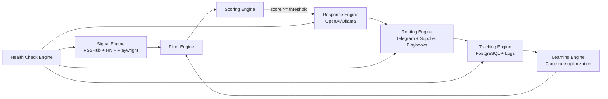

# MOORE MONEY SYSTEM Architecture

## Module Boundaries
- `signal_engine.py`: only ingestion from real public sources.
- `filter_engine.py`: hard qualification rules (simple, paid, fast).
- `scoring_engine.py`: deterministic scoring formula.
- `response_engine.py`: AI messaging generation.
- `routing_engine.py`: playbook match + supplier routing.
- `tracking_engine.py`: event/deal/profit persistence.
- `learning_engine.py`: source-level conversion insights.
- `health_check_engine.py`: safety checks + fail alerts.
